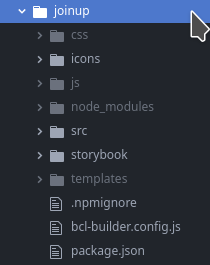

## OEL Bootstrap based Component Library template

Library of components based on [Bootstrap 5](https://github.com/twbs/bootstrap/tree/v5.0.1)


[](https://github.com/prettier/prettier)
[](https://lernajs.io/)

## Introduction

This library is mainly a development environment for components released as
packages on [npm](https://npmjs.org) under the @openeuropa organization and it
provides a style-guide using storybook where all the components are rendered
through the twig templates defined in the library and most of their capabilities
are visible thanks to interactive fields called controls.

## Usage

Be sure to have [Node.js](https://nodejs.org/) as well as yarn installed before
proceeding, this library uses the current LTS version of node.js, named
[fermium](https://nodejs.org/download/release/latest-fermium/)

```shell
# Clone the repo
git clone https://github.com/openeuropa/bootstrap-component-library
cd bootstrap-component-library

# Install dependencies and build the themes
yarn

# Start a development session (storybook with browsersync )
yarn start {project}
```

- Open <http://localhost:5000> to see the storybook instance.
- Use <http://localhost:3000> to enjoy live reloading on storybook.


## Npm packages

The components are released as single, standalone packages providing a twig
template but those templates are also available in the theme packages.
The theme packages contain source files (scss, js, twig) as well as the compiled
resources ready to be used.
A package defined as a dependency by the themes is making the bootstrap source
files available to each of the theme packages.

[List of npm packages](docs/packages.md)

### How to use a package from npm

- fetch the package with npm or yarn, e.g.
  `npm install @openeuropa/bcl-theme-default` or
  `yarn add @openeuropa/bcl-theme-default`
- include the templates in your application, you will need a `twig loader`
  capable of identifying the templates using their namespace `@oe-bcl`.

  ```twig
  

  ```

### BCL builder

The `@openeuropa/bcl-builder` is a package providing scripts to be executed via 
the command line, `styles`, `scripts`, `copy`, `rename` and `sprite`.
They can be used respectively to compile SASS files and minify css
files, compile and minify js files, to copy files or rename files and to generate
svg sprites.
It comes with a `bin` file that is available when the package is installed and
can be run as `npm run ecl-builder scriptName`.
It supports a configuration file `bcl-builder.config.js` where each script can
be configured to perform specific operations in the enviroment where they are
used.
Examples of the configuration files are available in the theme packages, the
`bcl-builder` is used to build those packages in the library as well.

### Anatomy of a theme package

The theme packages aim to be a ready solution for integrating the library
in any platform supporting twig:



Each theme package is meant to provide all the needed resources in terms of css,
js, twig templates and icons.
Js is offered in three different formats, `umd` (universal module definition),
`esm` (ES Modules) and the `bundle`  (which includes popper Js), similarly to
what happens with the files distributed by the bootstrap library.
All the files come with a `map` file and with a minified version ready for being
used in a production website.
The twig templates are in the `templates` folder inside a folder with the respective
package name so that they can be directly used with a loader defining the
`@oe-bcl` namespace and pointing at the `templates` folder.

### Twig templates

The twig packages are available as individual npm packages but also directly
available in the theme packages, the `@openeuropa/bcl-twig-templates` package
which is a collection of all the BCL default templates stored in a folder
with the package name.

#### Twig loader

The library uses `@oe-bcl` as the namespaces for the templates so a typical
twig-loader would be defined as such:

`loader.addPath(pathToTheTemplatesFolder, "oe-bcl");`

## Developer's guidelines

[Developer's guidelines](docs/developing.md)

### Setup on Windows using WSL 1

#### Setup WSL

1. Open Settings
2. Click on Apps & features
3. Under the "Related settings" section, click the Programs and Features option.
4. Click the Turn Windows features on or off option from the left pane.
5. Check the Windows Subsystem for Linux option.
6. Click the OK button.
7. Click the Restart now button.
8. After Restart, Open Powershell with admin.
9. Run `wsl --set-default-version 1`.

#### Setup Ubuntu

1. Open Microsoft Store.
2. Search for Ubuntu.
3. Select Ubuntu.
4. Click Get/Install.
5. After installation, click launch.
6. Create a username for the Linux distro and press Enter.
7. Specify a password for the distro and press Enter.
8. Repeat the password and press Enter to confirm.

#### Setup project

1. Clone the project.
2. In the project root, run `sudo yarn`.
3. Type the password you entered.
4. Run `sudo yarn start` and access `localhost:5000`.

```

```
